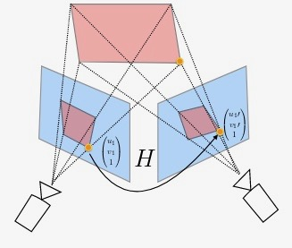
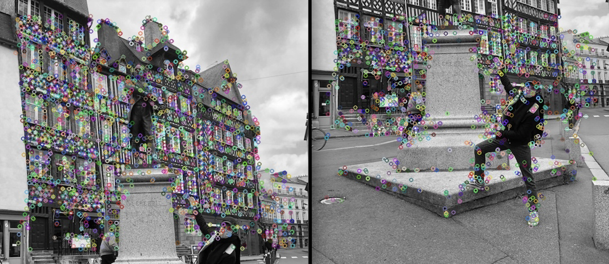

# Panorama Stitching

Image stitching consists in combining a group of images with overlapping fields of view to produce a segmented panorama. Algorithms for stitching images are widely used in computer vision, for example they are applied to produce satellite photos, they are applied in medical imaging, ...

Here is the list of steps what we should do to get our final stiched result:
1. Identify the interst points and descriptors for the two images
2. Compute distances between every descriptor in one image and every descriptor in the other image
3. Select the top best matches for each descriptor of an image
4. Run RANSAC to estimate homography
5. Warp to align for stitching
6. Finally stitch them together.

## Project
In this project we look at an example of automatically creating panoramas.

## Homographies
In the project we will make use of homographies. A homography is a 2D projective transformation that maps points in one plane to another. Any two images of the same planar surface in space are related by a homography. In our case the planes are images (or planar surfaces in 3D). Homographies have many practical uses such as registering images, rectifying images, texture warping and finally in our case: creating panoramas! 
 

In essence a homography H maps 2D points (in homogeneous coordinates) according to:

        [ x' ]   [ h1 h2 h3 ]   [ x ]
        [ y' ] = [ h4 h5 h6 ] * [ y ]    or    X' = H*X  
        [ w' ]   [ h7 h8 h9 ]   [ w ]

There are many algorithms for estimating homographies.

## Creating Panoramas
Two (or more) images that are taken at the same location (that is, the camera position is the same for the images) are homographically related. This is frequently used for creating panoramic images where several images are stitched together into one big mosaic. For example, the following two pictures are related by a homography:

## RANSAC
Once we have homographically related images we still need to find the right homography.
Here we are interested in automatically finding this homography for the panorama images using a set of possible correspondences. The following figures shows the matching correspondences found automatically using AKAZE:

On this image it seems that the correspondences are correct.
Then, we fit the homography using RANSAC applied to the correspondences.

## Stitching the images together
With the homographies between the images estimated (using RANSAC) we now need to warp all images to a common image plane. The resulting panorama image is shown below. In this case the result is pretty good because the input images were highly correlated but usually output images reflect the effects of different exposure and edge effects at the boundaries between individual images. This is why commercial panorama software has extra processing to normalize intensity and smooth transitions to make the result look even better.

  

