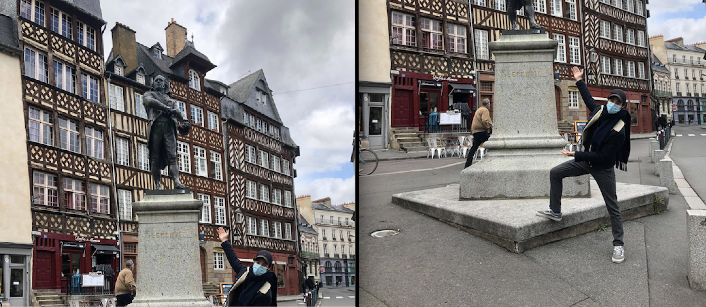
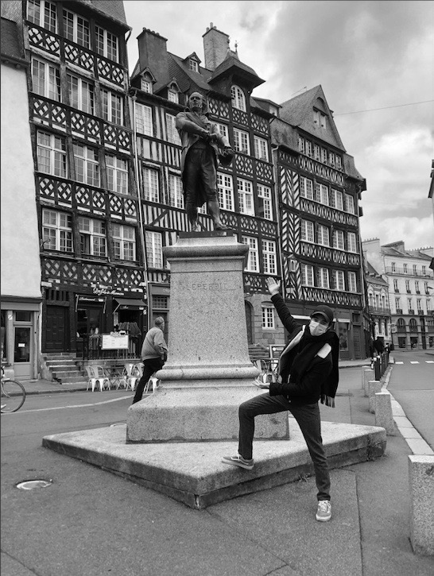

# Panorama Stitching

Image stitching consists in combining a group of images with overlapping fields of view to produce a segmented panorama. Algorithms for stitching images are widely used in computer vision, for example they are applied to produce satellite photos, they are applied in medical imaging, ...

Here is the list of steps what we should do to get our final stiched result:

1. Identify the interst points and descriptors for the two images
2. Compute distances between every descriptor in one image and every descriptor in the other image
3. Select the top best matches for each descriptor of an image
4. Run RANSAC to estimate homography.
5. Warp to align for stitching.
6. Finally stitch them together.

How do they work?
They extract a sparse set of features and match them to each other,

1. Detection: Identify the interest points
We first need to identify the interest points which should be repeatable and distinctive, and then extract vector feature descriptor surrounding each of these points. For that we use an opencv feature extractor and descriptor (to detect and compute features on both images).

Keypoint detection: repeatable and distinctive
– Corners, blobs, stable regions – Harris, DoG
2. Description: Extract vector feature descriptor surrounding each interest point.
Descriptors: robust and selective
– spatial histograms of orientation
– SIFT and variants are typically
good for stitching and recognition
– Many others (different tradeoffs)
3. Matching: Determine correspondence between descriptors in two views

## Results

1. use an opencv feature extractor and descriptor to detect and compute features on both images

2. use a descriptor matcher, to compute feature correspondences

3. Organize the matched feature pairs into vectors and estimate an homography using RANSAC and a model reprojection threshold of 3 pixels provide a mask input to draw the inlier matches

4. copy I1 to a new (bigger image) K using the identity homography warp I2 to K using the computed homography
  
5. does it work when the images are rotated so that they are not approximately aligned at first ? make a panorama with the rotated version IMG_0046r.JPG of image IMG_0046.JPG
	
6. make it work on 2 images of your own submit this cpp file, a screenshot of the labs' panorama, your input files and a screenshot of your own panorama.

